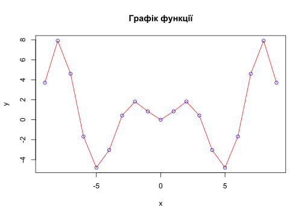
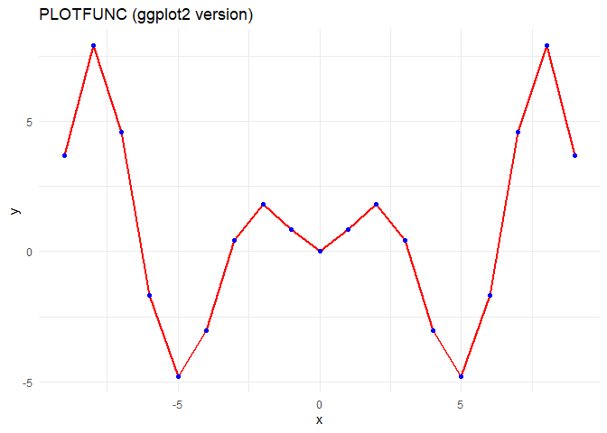
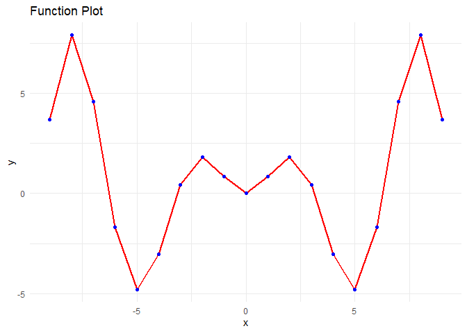

lb2
================
Саєнко Олексій
2025-11-30


Тема. Створення проєкту зі статистичної обробки даних у стилі literate
programming
<p>

</p>

Мета: швидкий старт для роботи в середовищі RStudio із застосуванням
концепції «грамотного програмування» засобами мови програмування R,
пакету RMarkdown та системи комп’ютерної верстки LaTeX

``` r
# Задаємо параметри функції
b0 <- 2
b1 <- 3
b2 <- 1.57

# Задаємо область визначення

x <- seq(-9,9, 1)
y <- sin(x) * x


plot(x, y,
     type = "l",
     col = "red",
     main = "Графік функції",
     xlab = "x",
     ylab = "y"
     )
points(x, y,
       col = "blue")
```

<!-- -->

``` r
df <- data.frame(x = x, y = y) 
```

``` r
library(rio)
library(knitr)
export(df, "data/data.csv")
knitr::kable(head(df), caption = "Табл. 1. Фрагмент даних", align = "c")
```

|  x  |     y     |
|:---:|:---------:|
| -9  | 3.709066  |
| -8  | 7.914866  |
| -7  | 4.598906  |
| -6  | -1.676493 |
| -5  | -4.794621 |
| -4  | -3.027210 |

Табл. 1. Фрагмент даних

``` r
dfNew <- import("data/data.csv")
# Таблиця засобами knitr
knitr::kable(head(dfNew),
caption = "_Табл. 1. Фрагмент таблиці даних_")
```

|   x |         y |
|----:|----------:|
|  -9 |  3.709066 |
|  -8 |  7.914866 |
|  -7 |  4.598906 |
|  -6 | -1.676493 |
|  -5 | -4.794621 |
|  -4 | -3.027210 |

*Табл. 1. Фрагмент таблиці даних*

Таблиця засобами stargazer

``` r
 stargazer::stargazer(head(dfNew),
 type = "html",
 summary = FALSE,
 title = "_Табл. 1. Фрагмент таблиці даних_")
```

<table style="text-align:center">

<caption>

<strong>1. Фрагмент таблиці даних</strong>
</caption>

<tr>

<td colspan="3" style="border-bottom: 1px solid black">

</td>

</tr>

<tr>

<td style="text-align:left">

</td>

<td>

x
</td>

<td>

y
</td>

</tr>

<tr>

<td colspan="3" style="border-bottom: 1px solid black">

</td>

</tr>

<tr>

<td style="text-align:left">

1
</td>

<td>

-9
</td>

<td>

3.709
</td>

</tr>

<tr>

<td style="text-align:left">

2
</td>

<td>

-8
</td>

<td>

7.915
</td>

</tr>

<tr>

<td style="text-align:left">

3
</td>

<td>

-7
</td>

<td>

4.599
</td>

</tr>

<tr>

<td style="text-align:left">

4
</td>

<td>

-6
</td>

<td>

-1.676
</td>

</tr>

<tr>

<td style="text-align:left">

5
</td>

<td>

-5
</td>

<td>

-4.795
</td>

</tr>

<tr>

<td style="text-align:left">

6
</td>

<td>

-4
</td>

<td>

-3.027
</td>

</tr>

<tr>

<td colspan="3" style="border-bottom: 1px solid black">

</td>

</tr>

</table>

Таблиця засобами xtable

``` r
library(xtable)
print(xtable(head(df)), type = "html")
```

<!-- html table generated in R 4.5.2 by xtable 1.8-4 package -->

<!-- Fri Dec  5 20:57:43 2025 -->

<table border="1">

<tr>

<th>

</th>

<th>

x
</th>

<th>

y
</th>

</tr>

<tr>

<td align="right">

1
</td>

<td align="right">

-9.00
</td>

<td align="right">

3.71
</td>

</tr>

<tr>

<td align="right">

2
</td>

<td align="right">

-8.00
</td>

<td align="right">

7.91
</td>

</tr>

<tr>

<td align="right">

3
</td>

<td align="right">

-7.00
</td>

<td align="right">

4.60
</td>

</tr>

<tr>

<td align="right">

4
</td>

<td align="right">

-6.00
</td>

<td align="right">

-1.68
</td>

</tr>

<tr>

<td align="right">

5
</td>

<td align="right">

-5.00
</td>

<td align="right">

-4.79
</td>

</tr>

<tr>

<td align="right">

6
</td>

<td align="right">

-4.00
</td>

<td align="right">

-3.03
</td>

</tr>

</table>

Формуємо результуючу таблицю

``` r
tab_params <- data.frame(
  Параметр = c("$b_0$", "$b_1$", "$b_2$", "$x_{min}$", "$x_{max}$"),
  Значення = c(b0, b1, b2, min(x), max(x)) 
)


knitr::kable(tab_params, 
             caption = "Табл. 2. Параметри функції", 
             escape = FALSE,
             align = "c")   
```

| Параметр  | Значення |
|:---------:|:--------:|
|   $b_0$   |   2.00   |
|   $b_1$   |   3.00   |
|   $b_2$   |   1.57   |
| $x_{min}$ |  -9.00   |
| $x_{max}$ |   9.00   |

Табл. 2. Параметри функції

**3 . Оптимізувати код, наведений у цій методичці, за допомогою
потокового оператора %\>% засобами пакету ggplot2.**

``` r
library(dplyr)
library(ggplot2)
library(DT)
library(knitr)

b0 <- 2
b1 <- 3
b2 <- 1.57

df <- data.frame(x = seq(-9,9, 1)) %>%
  mutate(y = sin(x) * x)

plot_obj <- df %>%
  ggplot(aes(x = x, y = y)) +
  geom_line(color = "red", size = 1) +
  geom_point(color = "blue", size = 1.5) +
  labs(title = "PLOTFUNC (ggplot2 version)",
       x = "x",
       y = "y") +
  theme_minimal()

print(plot_obj)
```

<!-- -->

``` r
  df %>%
  knitr::kable(caption = "Таблиця 1. Фрагмент даних", align = "c")
```

|  x  |     y     |
|:---:|:---------:|
| -9  | 3.709066  |
| -8  | 7.914866  |
| -7  | 4.598906  |
| -6  | -1.676493 |
| -5  | -4.794621 |
| -4  | -3.027210 |
| -3  | 0.423360  |
| -2  | 1.818595  |
| -1  | 0.841471  |
|  0  | 0.000000  |
|  1  | 0.841471  |
|  2  | 1.818595  |
|  3  | 0.423360  |
|  4  | -3.027210 |
|  5  | -4.794621 |
|  6  | -1.676493 |
|  7  | 4.598906  |
|  8  | 7.914866  |
|  9  | 3.709066  |

Таблиця 1. Фрагмент даних

``` r
data.frame(
  Параметр = c("$b_0$", "$b_1$", "$b_2$", "$x_{min}$", "$x_{max}$"),
  Значення = c(b0, b1, b2, min(df$x), max(df$x))
) %>%
  knitr::kable(caption = "Табл. 2. Параметри функції",
        escape = FALSE,
        align = "c")
```

| Параметр  | Значення |
|:---------:|:--------:|
|   $b_0$   |   2.00   |
|   $b_1$   |   3.00   |
|   $b_2$   |   1.57   |
| $x_{min}$ |  -9.00   |
| $x_{max}$ |   9.00   |

Табл. 2. Параметри функції

**4 . Побудувати графік функції засобами пакету ggplot2.**

``` r
library(ggplot2)

x_vals <- seq(-9,9, by = 1)
y_vals <- sin(x_vals) * x_vals

df <- data.frame(x = x_vals, y = y_vals)

ggplot(df, aes(x = x, y = y)) +
  geom_line(color = "red", size = 1) +
  geom_point(color = "blue", size = 1.5) +
  labs(title = "Function Plot", x = "x", y = "y") +
  theme_minimal()
```

<!-- -->

<center>

**Контрольні питання**
</center>

1 . Напишіть код на LaTeX для формули щільності нормального розподілу -
$$ f(x) = \frac{1}{\sigma\sqrt{2\pi}} e^{-\frac{1}{2}\left(\frac{x-\mu}{\sigma}\right)^2} $$

2 . Як розв’язати таблиці і графіки в електронний документ з
використанням R Markdown і пакету rmarkdown з оглядом на читабельність
та грамотність коду? - Для цього треба : 1-Налаштувати структуру 2 -
Грамтно писати код , використовувати %\>% та ggplot2 3 - використовувати
для коротких зведень і параметрів статичну функцію knitr::kable, а для
великих масивів даних — інтерактивну DT::datatable, яка дозволяє гортати
та фільтрувати рядки.

3 . Як вирішити завдання зі вставленням та форматуванням зображень
велектронному документі з використанням R, забезпечуючи читабельність
таелегантність коду? - Для цього підійде використання функції
knitr::include_graphics().Або якщо не треба форматувати то підійде .

4 . Яку функцію виконує YAML-заголовок у динамічному документі? -
головними функціями є - 1.Визначення кінцевого формату 2.Налаштування
зовнішнього вигляду документу.3.Збереження мета даних(title,author,date)
