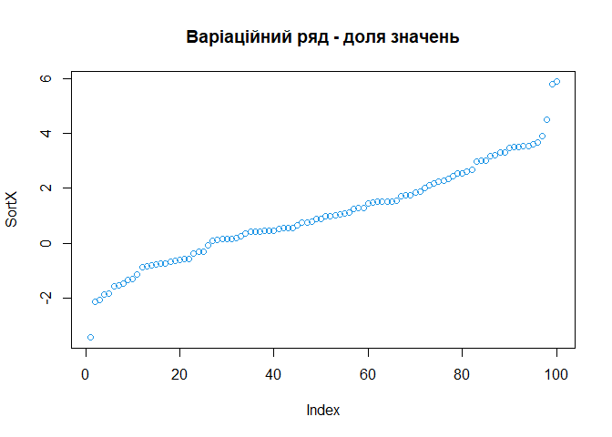
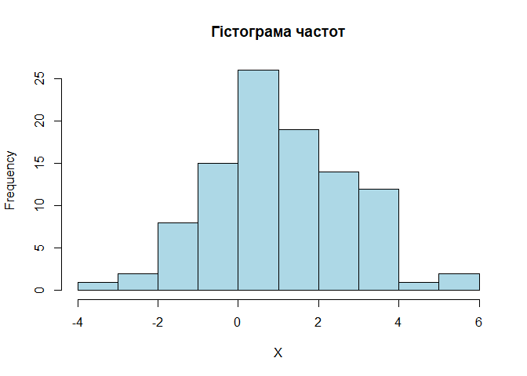
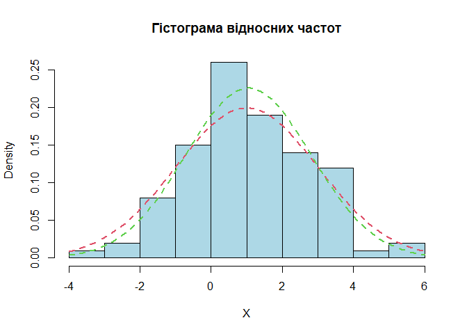
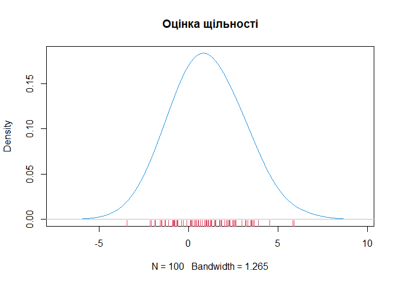
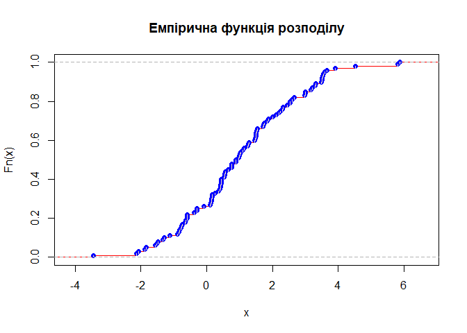
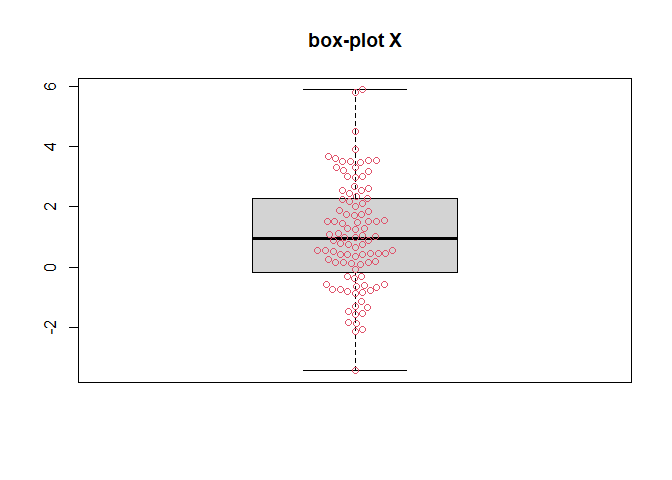
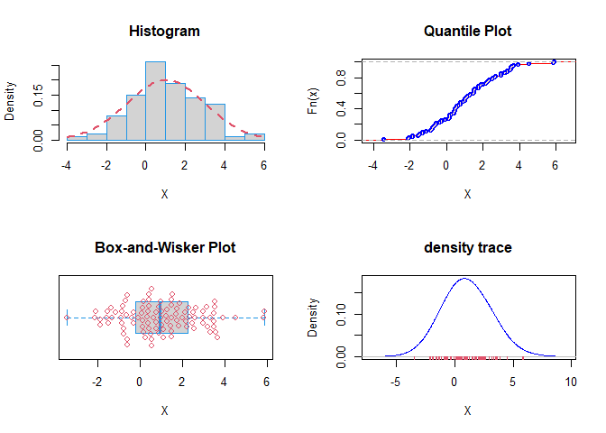

Лабараторна робота 3
================
Саєнко Олексій
2025-11-30


- [**Лабораторна робота № 3. Основи вибіркового
  методу**](#лабораторна-робота--3-основи-вибіркового-методу)
- [**1. Постановка задачі**](#1-постановка-задачі)
- [**2. Генерація вибірки n = 100**](#2-генерація-вибірки-n--100)
- [**3. Інтервальний розподіл та
  гістограми**](#3-інтервальний-розподіл-та-гістограми)
- [**4. Сумарні статистики**](#4-сумарні-статистики)
- [**5. Теоретичний та емпіричний
  розподіли**](#5-теоретичний-та-емпіричний-розподіли)
- [**6. Боксплот**](#6-боксплот)
- [**7. Компактний графічний вивід**](#7-компактний-графічний-вивід)
- [**8. Результуюча таблиця**](#8-результуюча-таблиця)
- [**9. Контрольні питання**](#9-контрольні-питання)

# **Лабораторна робота № 3. Основи вибіркового методу**

**Мета:** засвоїти основи статистичного оцінювання характеристик
випадкової величини на основі вибіркового підходу з використанням мови R
та R Markdown.

# **1. Постановка задачі**

Випадкова величина  
$$
X \sim N(a,\sigma^2)
$$ де параметри відомі:  
$$
(a,\sigma^2) = (1,4),\quad \sigma = 2.
$$

Необхідно:

1.  Згенерувати дві вибірки розмірів n = 100 та n = 1000.
2.  Побудувати інтервальний розподіл, гістограму, теоретичну та
    емпіричну щільність.
3.  Побудувати теоретичну та емпіричну функції розподілу.
4.  Побудувати boxplot.
5.  Обчислити точкові оцінки параметрів, включаючи моменти, асиметрію та
    ексцес.
6.  Заповнити підсумкову таблицю.

# **2. Генерація вибірки n = 100**

``` r
set.seed(0) 
n <- 100  
a <- 1  
s <- 2 
X <- rnorm(n, a, s)
cat("\n", "Параметри вибірки:", "\n", 
    "a = ", a, "\n" , 
    "s = ", s, "\n" , 
    "n = ", n, "\n")
```

    ## 
    ##  Параметри вибірки: 
    ##  a =  1 
    ##  s =  2 
    ##  n =  100

``` r
cat("Перші елементи вибірки:", head(X))
```

    ## Перші елементи вибірки: 3.525909 0.3475333 3.659599 3.544859 1.829283 -2.0799

``` r
cat("Останні елементи вибірки:", tail(X))
```

    ## Останні елементи вибірки: 2.192518 1.239435 0.4356522 3.911977 1.458039 2.993088

``` r
SortX <- sort(X)
plot(SortX, col=4)
title("Варіаційний ряд - доля значень")
```

<!-- -->

# **3. Інтервальний розподіл та гістограми**

``` r
1 + 1.332 * log(n)
```

    ## [1] 7.134087

``` r
table(cut(X, nclass.Sturges(X)))
```

    ## 
    ##  (-3.46,-2.28]  (-2.28,-1.12] (-1.12,0.0511]  (0.0511,1.22]    (1.22,2.38] 
    ##              1             10             15             30             21 
    ##    (2.38,3.55]    (3.55,4.72]    (4.72,5.89] 
    ##             17              4              2

``` r
hist(X, breaks=nclass.Sturges(X),
     col="Lightblue",
     main="Гістограма частот")
```

<!-- -->

``` r
hist(X,
     freq = FALSE,
     col = "Lightblue",
     main = "Гістограма відносних частот")
curve(dnorm(x, a, s), col = 2, lty = 2, lwd = 2, add = TRUE) 
curve(dnorm(x, mean(X), sd(X)), col = 3, lty = 2, lwd = 2, add = TRUE)
```

<!-- -->

# **4. Сумарні статистики**

``` r
summary(X)
```

    ##    Min. 1st Qu.  Median    Mean 3rd Qu.    Max. 
    ## -3.4478 -0.1388  0.9341  1.0453  2.2507  5.8827

``` r
mean(X)
```

    ## [1] 1.045337

``` r
sd(X)
```

    ## [1] 1.7653

``` r
IQR(X)
```

    ## [1] 2.38954

``` r
library(Hmisc)
```

    ## 
    ## Attaching package: 'Hmisc'

    ## The following objects are masked from 'package:base':
    ## 
    ##     format.pval, units

``` r
describe(X)
```

    ## X 
    ##        n  missing distinct     Info     Mean  pMedian      Gmd      .05 
    ##      100        0      100        1    1.045    1.002    1.999  -1.5832 
    ##      .10      .25      .50      .75      .90      .95 
    ##  -1.1476  -0.1388   0.9341   2.2507   3.4798   3.6017 
    ## 
    ## lowest : -3.4478  -2.12756 -2.0799  -1.87517 -1.8502 
    ## highest: 3.6596   3.91198  4.51581  5.80931  5.88273

``` r
library(moments)
my_summary <- function(X, ...) {
  cat("\n", "Оцінки статистичних характеристик вибірки:", "\n", 
      "вибіркове математичне сподівання, m = ", mean(X), "\n",
      "Медіана, Ме = ", median(X) , "\n",
      "вибіркова дисперсія, s^2 = ", var(X), "\n" ,
      "вибіркове СКВ, s = ", sd(X), "\n" ,
      "Розмах, R = ", max(X) - min(X), "\n" ,
      "Інтерквартільний розмах, IQR = ", IQR(X), "\n",
      "Ексцес, Ek = ", kurtosis(X), "\n",
      "Асиметрія, As = ", skewness(X), "\n"
    )
}

my_summary(X,  na.rm = FALSE)
```

    ## 
    ##  Оцінки статистичних характеристик вибірки: 
    ##  вибіркове математичне сподівання, m =  1.045337 
    ##  Медіана, Ме =  0.934077 
    ##  вибіркова дисперсія, s^2 =  3.116285 
    ##  вибіркове СКВ, s =  1.7653 
    ##  Розмах, R =  9.33053 
    ##  Інтерквартільний розмах, IQR =  2.38954 
    ##  Ексцес, Ek =  2.959992 
    ##  Асиметрія, As =  0.2273757

# **5. Теоретичний та емпіричний розподіли**

``` r
plot(density(X, adjust=2), main="Оцінка щільності", col=4)
rug(X, col=2)
```

<!-- -->

``` r
Fn <- ecdf(X)

plot(Fn,
     verticals = TRUE,
     col.points = "blue",
     col.hor = "red",
     col.vert = "bisque",
     main = "Емпірична функція розподілу")
```

<!-- -->

# **6. Боксплот**

``` r
library(beeswarm)
boxplot(X, main="box-plot X")  
beeswarm(X, col=2, add=TRUE) 
```

<!-- -->

# **7. Компактний графічний вивід**

``` r
library(beeswarm)
library(moments)

if (!exists("X")) {
  set.seed(0)
  n <- 100
  a <- 1
  s <- 2
  X <- rnorm(n, a, s)
  Fn <- ecdf(X)
}

op <- par(mfrow = c(2,2))

hist(X, freq = FALSE, col = "Lightgray", main="Histogram", border=4)
curve(dnorm(x, a, s), col = 2, lty = 2, lwd = 2, add = TRUE)

plot(Fn, main = "Quantile Plot", verticals = TRUE, 
     col.points = "blue", col.hor = "red", col.vert = "bisque",
     xlab = "X", ylab = "Fn(x)")

boxplot(X, main = "Box-and-Wisker Plot", col = "Lightgray", border = 4, 
        xlab = "X", ylab = "", horizontal = TRUE)
beeswarm(X, col = 2, add = TRUE, horizontal = TRUE)

plot(density(X, adjust = 2), main = "density trace", 
     xlab = "X", ylab = "Density", col = "blue")
rug(X, col = 2)
```

<!-- -->

``` r
par(op)
```

# **8. Результуюча таблиця**

``` r
n1000 <- 1000
X1000 <- rnorm(n1000, a, s)

table_res <- data.frame(
  Характеристика = c("a теор.", "a вибіркове (100)", "a вибіркове (1000)",
                     "σ теор.", "σ вибіркове (100)", "σ вибіркове (1000)",
                     "D теор.", "D вибіркове (100)", "D вибіркове (1000)"),
  Значення = c(
    a,
    mean(X),
    mean(X1000),
    s,
    sd(X),
    sd(X1000),
    s^2,
    var(X),
    var(X1000)
  )
)

table_res
```

    ##       Характеристика  Значення
    ## 1            a теор. 1.0000000
    ## 2  a вибіркове (100) 1.0453369
    ## 3 a вибіркове (1000) 0.9272134
    ## 4            σ теор. 2.0000000
    ## 5  σ вибіркове (100) 1.7653004
    ## 6 σ вибіркове (1000) 2.0204474
    ## 7            D теор. 4.0000000
    ## 8  D вибіркове (100) 3.1162855
    ## 9 D вибіркове (1000) 4.0822077

# **9. Контрольні питання**

1.  Що таке вибірка?

Вибірка — це набір значень випадкової величини, отриманий у результаті
експерименту або спостереження. Вона використовується для оцінювання
характеристик генеральної сукупності, коли немає можливості працювати з
усією сукупністю.

2.  Як можна оцінити вибіркове математичне сподівання?

Вибіркове математичне сподівання оцінюють як середнє арифметичне всіх
елементів вибірки. Це точкова оцінка середнього значення генеральної
сукупності, що наближає істинне математичне сподівання.

3.  Які існують міри розсіювання?

Основні міри розсіювання включають дисперсію, середнє квадратичне
відхилення, середнє абсолютне відхилення та розмах. Вони характеризують
ступінь відхилення значень вибірки від її середнього значення та
показують, наскільки вибірка «розкидана» у просторі значень.

4.  Які міри форми розподілу вам відомі? Що вони характеризують? Як їх
    оцінити на практиці?

До мір форми розподілу належать коефіцієнти асиметрії та ексцесу.
Асиметрія характеризує ступінь нерівномірності розподілу відносно його
середнього значення (перекіс). Ексцес описує «гостроверхість» або
«плосковерхість» порівняно з нормальним розподілом. На практиці їх
оцінюють за вибірковими формулами, що базуються на центральних моментах
відповідного порядку. — \# **Висновок**

У ході виконання лабораторної роботи було досліджено основні підходи
вибіркового методу для оцінювання параметрів випадкової величини з
нормальним розподілом. Було згенеровано вибірки різного обсягу,
побудовано інтервальні та графічні характеристики (гістограми,
щільності, функції розподілу, boxplot), а також обчислено точкові оцінки
основних статистичних параметрів: середнього, дисперсії, СКВ, асиметрії
та ексцесу.

Отримані результати підтвердили, що зі збільшенням обсягу вибірки оцінки
параметрів розподілу стають більш точними та наближеними до теоретичних
значень. Практичне застосування R та R Markdown дозволило формалізувати
процес аналізу, спростити обчислення та забезпечити reproducible
research — відтворюваність результатів. Лабораторна робота
продемонструвала важливість вибіркових характеристик у статистичному
аналізі та їх роль у наближенні до властивостей генеральної сукупності.
