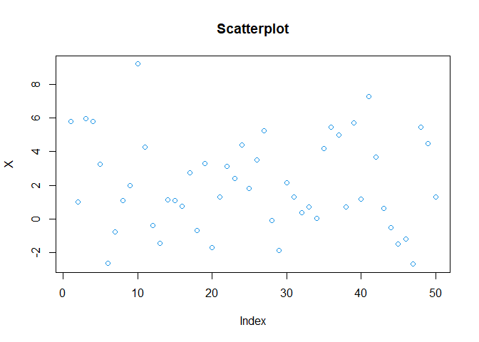
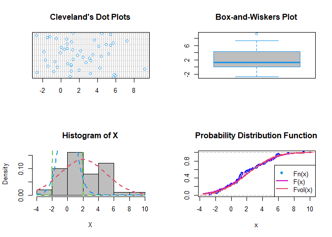
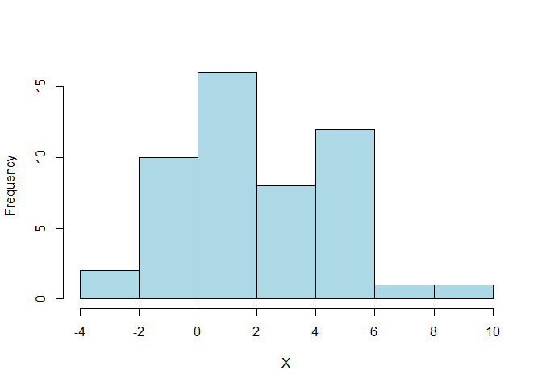
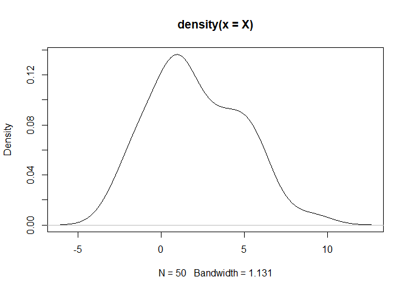
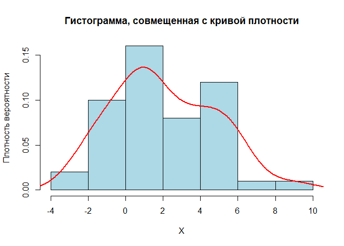
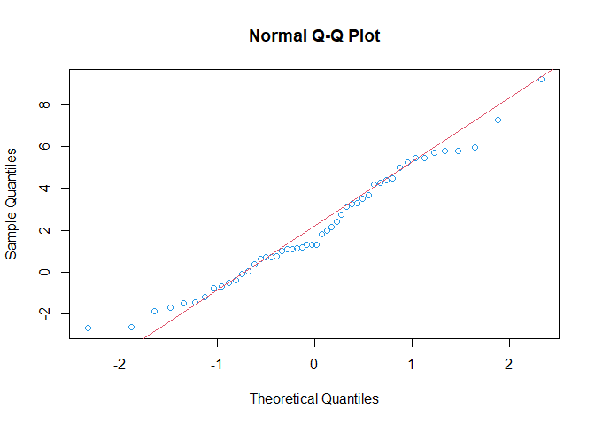
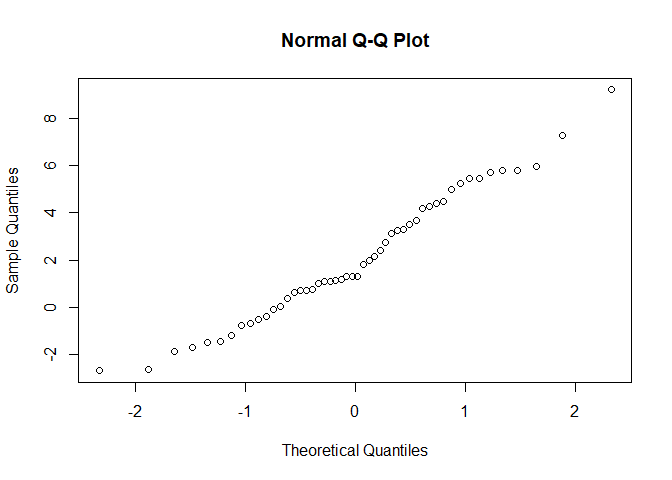
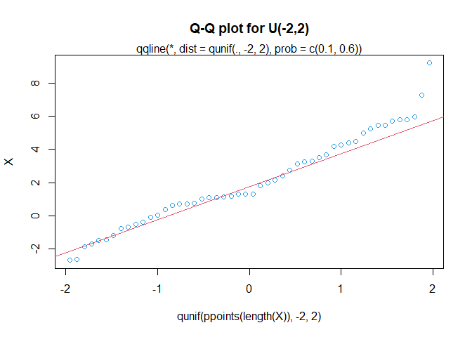

Лабараторна робота 4
================
Саєнко Олексій
2025-11-30


- [1. Постановка задачі](#1-постановка-задачі)
- [2. Генеруємо вибірку за допомогою генератора випадкових чисел і
  записуємо дані у
  файл](#2-генеруємо-вибірку-за-допомогою-генератора-випадкових-чисел-і-записуємо-дані-у-файл)
- [3. Обчислюємо вибіркові числові
  характеристики](#3-обчислюємо-вибіркові-числові-характеристики)
- [4. Графічне дослідження розподілу](#4-графічне-дослідження-розподілу)
  - [Будуємо гістограму](#будуємо-гістограму)
- [5. Перевірка на нормальність](#5-перевірка-на-нормальність)
- [6. Проводимо тести нормальності](#6-проводимо-тести-нормальності)
- [7. Повторення дослідження для n =
  1000](#7-повторення-дослідження-для-n--1000)
- [8. Контрольні питання](#8-контрольні-питання)

**Лабораторна робота № 4. Перевірка статистичних гіпотез щодо закону
розподілу. Перевірка на нормальність**

**Мета:** засвоїти ідею методики перевірки статистичних гіпотез щодо
закону розподілу випадкової величини засобами мови програмування R;
набути навичок роботи у середовищі RStudio із застосуванням концепції
“грамотного програмування” із застосуванням пакету R Markdown.

------------------------------------------------------------------------

## 1. Постановка задачі

Випадкова величина $X$ має заданий закон розподілу, вектор параметрів
якого відомий.  
Нехай  
$$
X \sim N(a,\sigma^2), \quad (a,\sigma^2) = (2, 9), \quad \sigma = 3.
$$

Згенерувати згідно з варіантом вибірку випадкової величини
$X = (x_1,...,x_n)$: спочатку об’єму $n = 50$, що має заданий розподіл,
обчислити оцінку вектора параметрів розподілу. Висунути і перевірити
статистичну гіпотезу щодо нормального закону розподілу величини $X$:

$$
H_0: f(x) \in \{N(x,\mu,\sigma^2), \mu \in M, \sigma^2 \in \Sigma^2\}
$$ $$
H_1: f(x) \notin \{N(x,\mu,\sigma^2), \mu \in M, \sigma^2 \in \Sigma^2\}
$$

Повторити дослідження для $n = 1000$. Порівняти результати, зробити
висновки.

------------------------------------------------------------------------

## 2. Генеруємо вибірку за допомогою генератора випадкових чисел і записуємо дані у файл

``` r
set.seed(0)
a <- 2
s <- 3
n <- 50

X <- rnorm(n, a, s) # генеруємо вибірку
head(X)
```

    ## [1]  5.788863  1.021300  5.989398  5.817288  3.243924 -2.619850

``` r
if (!dir.exists("data")) {
  dir.create("data")
}

write.table(
  file      = "data/X4.csv",
  X,
  row.names = FALSE,
  dec       = ".",
  col.names = FALSE,
  sep       = ";",
  quote     = FALSE
)

rm(X)

X <- read.table("data/X4.csv")
X <- as.numeric(X$V1)

head(X)
```

    ## [1]  5.788863  1.021300  5.989398  5.817288  3.243924 -2.619850

``` r
tail(X)
```

    ## [1] -1.499712 -1.196772 -2.691346  5.469611  4.496141  1.318014

``` r
plot(X, main = "Scatterplot", col = 4)
```

<!-- -->

------------------------------------------------------------------------

## 3. Обчислюємо вибіркові числові характеристики

``` r
get_distribution_stats <- function(x, na.rm = TRUE) {
  if (na.rm) x <- na.omit(x)
  
  n <- length(x)
  if (n < 4) {
    stop("Розмір вибірки має бути не менше 4 елементів для розрахунку ексцесу.")
  }
  
  mean_x <- mean(x)
  sd_x   <- sd(x)
  
  dev       <- x - mean_x
  sum_pow3  <- sum(dev^3)
  sum_pow4  <- sum(dev^4)
  
  skew <- (n * sum_pow3) / ((n - 1) * (n - 2) * sd_x^3)
  
  term1 <- (n * (n + 1) * sum_pow4) / ((n - 1) * (n - 2) * (n - 3) * sd_x^4)
  term2 <- (3 * (n - 1)^2) / ((n - 2) * (n - 3))
  kurt  <- term1 - term2
  
  se_skew <- sqrt((6 * n * (n - 1)) / ((n - 2) * (n + 1) * (n + 3)))
  se_kurt <- 2 * se_skew * sqrt((n^2 - 1) / ((n - 3) * (n + 5)))
  
  z_skew <- skew / se_skew
  z_kurt <- kurt / se_kurt
  
  result <- c(
    Skewness      = skew,
    SE_Skew       = se_skew,
    Z_Skew_Score  = z_skew,
    Kurtosis      = kurt,
    SE_Kurt       = se_kurt,
    Z_Kurt_Score  = z_kurt
  )
  
  return(round(result, 4))
}

stats <- get_distribution_stats(X)
print(stats)
```

    ##     Skewness      SE_Skew Z_Skew_Score     Kurtosis      SE_Kurt Z_Kurt_Score 
    ##       0.3549       0.3366       1.0543      -0.4300       0.6619      -0.6496

``` r
get_full_stats <- function(x) {
  x <- na.omit(x)
  n <- length(x)
  
  if (n < 4) stop("Розмір вибірки має бути не менше 4")
  
  mean_val <- mean(x)
  var_val  <- var(x)
  sd_val   <- sd(x)
  
  dev      <- x - mean_val
  sum_pow3 <- sum(dev^3)
  sum_pow4 <- sum(dev^4)
  
  skew <- (n * sum_pow3) / ((n - 1) * (n - 2) * sd_val^3)
  
  term1 <- (n * (n + 1) * sum_pow4) / ((n - 1) * (n - 2) * (n - 3) * sd_val^4)
  term2 <- (3 * (n - 1)^2) / ((n - 2) * (n - 3))
  kurt  <- term1 - term2
  
  se_skew <- sqrt((6 * n * (n - 1)) / ((n - 2) * (n + 1) * (n + 3)))
  se_kurt <- 2 * se_skew * sqrt((n^2 - 1) / ((n - 3) * (n + 5)))
  
  z_skew <- skew / se_skew
  z_kurt <- kurt / se_kurt
  
  data.frame(
    Показник = c("Математичне сподівання", "Дисперсія", "СКВ", 
                 "Асиметрія", "Ексцес", 
                 "Z-значення Асиметрії", "Z-значення Ексцесу"),
    Значення = round(c(mean_val, var_val, sd_val, skew, kurt, z_skew, z_kurt), 4)
  )
}

print(get_full_stats(X))
```

    ##                 Показник Значення
    ## 1 Математичне сподівання   2.0718
    ## 2              Дисперсія   7.5564
    ## 3                    СКВ   2.7489
    ## 4              Асиметрія   0.3549
    ## 5                 Ексцес  -0.4300
    ## 6   Z-значення Асиметрії   1.0543
    ## 7     Z-значення Ексцесу  -0.6496

``` r
summary(X)
```

    ##    Min. 1st Qu.  Median    Mean 3rd Qu.    Max. 
    ## -2.6913  0.1315  1.3226  2.0718  4.2631  9.2140

``` r
mean(X)
```

    ## [1] 2.071793

``` r
sd(X)
```

    ## [1] 2.748884

------------------------------------------------------------------------

## 4. Графічне дослідження розподілу

``` r
op <- par(mfrow = c(2,2)) 

dotchart(X, main = "Cleveland's Dot Plots", col = 4) 

boxplot(X, width = 2,
        range = 1, 
        col = "gray",
        border = 4, 
        main = "Box-and-Wiskers Plot")

hist(X, freq = FALSE,
     breaks = nclass.Sturges(X),
     col = "grey")

curve(dnorm(x, a, s),
      col = 2, 
      lty = 2, 
      lwd = 2, 
      add = TRUE) 

curve(dunif(x, -2, 2),
      col = 3, 
      lty = 2, 
      lwd = 2, 
      add = TRUE) 

curve(dt(x, df = 10),
      col = 4,
      lty = 2,
      lwd = 2,
      add = TRUE) 

Fn <- ecdf(X)
plot(Fn,
     ylab = "",
     verticals = TRUE, 
     col.points = "blue",
     col.hor = "red",
     col.vert = "bisque",
     main = "Probability Distribution Function")

curve(pnorm(x, a, s),
      col = 6,
      lty = 1,
      lwd = 2,
      add = TRUE) 

curve(pnorm(x, mean(X), sd(X)),
      col = 2,
      lty = 1,
      lwd = 2,
      add = TRUE) 

legend("bottomright",
       pch = c(19, NA, NA),
       legend = c("Fn(x)", "F(x)", "Fvol(x)"),
       lty = c(1,1,1), col = c(4,6,2), lwd = c(NA,2,2))
```

<!-- -->

``` r
par(op)
```

### Будуємо гістограму

``` r
table(cut(X, nclass.Sturges(X))) 
```

    ## 
    ## (-2.7,-0.991] (-0.991,0.71]   (0.71,2.41]   (2.41,4.11]   (4.11,5.81] 
    ##             7             9            14             6            10 
    ##   (5.81,7.51]   (7.51,9.23] 
    ##             3             1

``` r
hist(X,
     breaks = nclass.Sturges(X),
     col = "lightblue",
     main = "") 
```

<!-- -->

``` r
plot(density(X))
```

<!-- -->

``` r
hist(X, 
     breaks = nclass.Sturges(X),
     freq = FALSE,
     col = "lightblue",
     xlab = "X",
     ylab = "Плотность вероятности",
     main = "Гистограмма, совмещенная с кривой плотности")

lines(density(X),
      col = "red",
      lwd = 2)
```

<!-- -->

------------------------------------------------------------------------

## 5. Перевірка на нормальність

``` r
quantile(X)
```

    ##         0%        25%        50%        75%       100% 
    ## -2.6913462  0.1315226  1.3226051  4.2631483  9.2139602

``` r
qqnorm(X, col = 4)
qqline(X, col = 2)
```

<!-- -->

``` r
qqnorm(X) 
```

<!-- -->

``` r
qqplot(qunif(ppoints(length(X)), -2, 2), X,
       main = "Q-Q plot for U(-2,2)", col = 4)

qqline(X, distribution = function(p) qunif(p, -2, 2),
       prob = c(0.1, 0.6),
       col = 2)

mtext("qqline(*, dist = qunif(., -2, 2), prob = c(0.1, 0.6))")
```

<!-- -->

------------------------------------------------------------------------

## 6. Проводимо тести нормальності

``` r
shapiro.test(X)
```

    ## 
    ##  Shapiro-Wilk normality test
    ## 
    ## data:  X
    ## W = 0.97356, p-value = 0.321

``` r
# Тест Колмогорова-Смірнова з теоретичною N(a, s)
ks.test(X, "pnorm", mean = a, sd = s)
```

    ## 
    ##  Exact one-sample Kolmogorov-Smirnov test
    ## 
    ## data:  X
    ## D = 0.10873, p-value = 0.5587
    ## alternative hypothesis: two-sided

``` r
# Порівняння з вибіркою з нормального розподілу
ks.test(X, rnorm(length(X)))
```

    ## 
    ##  Exact two-sample Kolmogorov-Smirnov test
    ## 
    ## data:  X and rnorm(length(X))
    ## D = 0.52, p-value = 1.581e-06
    ## alternative hypothesis: two-sided

Тест Колмогорова–Смірнова в модифікації Лілієфорса, критерій χ² Пірсона
і тест Шапіро–Франція:

``` r
library(nortest)

# Тест Колмогоровa–Смірновa (Лілієфорс)
lillie.test(X)
```

    ## 
    ##  Lilliefors (Kolmogorov-Smirnov) normality test
    ## 
    ## data:  X
    ## D = 0.12676, p-value = 0.04334

``` r
# Критерій χ² Пірсона
pearson.test(X)
```

    ## 
    ##  Pearson chi-square normality test
    ## 
    ## data:  X
    ## P = 14.8, p-value = 0.03865

``` r
pearson.test(X, n.classes = nclass.Sturges(X))
```

    ## 
    ##  Pearson chi-square normality test
    ## 
    ## data:  X
    ## P = 6, p-value = 0.1991

``` r
# Тест Шапіро–Франція
sf.test(X)
```

    ## 
    ##  Shapiro-Francia normality test
    ## 
    ## data:  X
    ## W = 0.97685, p-value = 0.3614

``` r
get_normality_tests <- function(x, alpha = 0.05) {
  if (!require("nortest")) {
    install.packages("nortest")
    library(nortest)
  }
  
  x <- na.omit(x)
  results_list <- list()
  
  st  <- shapiro.test(x)
  results_list[[1]] <- c("Shapiro-Wilk", st$statistic, st$p.value)
  
  lt  <- lillie.test(x)
  results_list[[2]] <- c("Lilliefors (K-S)", lt$statistic, lt$p.value)
  
  pt  <- pearson.test(x)
  results_list[[3]] <- c("Pearson Chi-square", pt$statistic, pt$p.value)
  
  sft <- sf.test(x)
  results_list[[4]] <- c("Shapiro-Francia", sft$statistic, sft$p.value)
  
  df <- data.frame(do.call(rbind, results_list), stringsAsFactors = FALSE)
  colnames(df) <- c("Тест", "Статистика", "P_value")
  
  df$Статистика <- as.numeric(df$Статистика)
  df$P_value    <- as.numeric(df$P_value)
  
  df$Результат <- ifelse(df$P_value > alpha, "Нормальний (+)", "Не нормальний (-)")
  
  df$Статистика <- round(df$Статистика, 4)
  df$P_value    <- format(df$P_value, digits = 4, scientific = FALSE)
  
  return(df)
}
```

``` r
table_results <- get_normality_tests(X)
print(table_results)
```

    ##                 Тест Статистика P_value         Результат
    ## 1       Shapiro-Wilk     0.9736 0.32101    Нормальний (+)
    ## 2   Lilliefors (K-S)     0.1268 0.04334 Не нормальний (-)
    ## 3 Pearson Chi-square    14.8000 0.03865 Не нормальний (-)
    ## 4    Shapiro-Francia     0.9768 0.36144    Нормальний (+)

------------------------------------------------------------------------

## 7. Повторення дослідження для n = 1000

``` r
n2 <- 1000
X2 <- rnorm(n2, a, s)

head(X2)
```

    ## [1]  4.3455776 -0.3303299  0.1520303  2.1397409 -1.3911573  3.7301563

``` r
tail(X2)
```

    ## [1] -3.745542 -3.771501  5.407151  5.723671 -1.472515  3.489866

``` r
summary(X2)
```

    ##    Min. 1st Qu.  Median    Mean 3rd Qu.    Max. 
    ## -7.7092 -0.2314  1.7968  1.8991  4.0629 11.7992

``` r
get_full_stats(X2)
```

    ##                 Показник Значення
    ## 1 Математичне сподівання   1.8991
    ## 2              Дисперсія   9.2766
    ## 3                    СКВ   3.0458
    ## 4              Асиметрія   0.0819
    ## 5                 Ексцес  -0.1823
    ## 6   Z-значення Асиметрії   1.0586
    ## 7     Z-значення Ексцесу  -1.1799

``` r
get_distribution_stats(X2)
```

    ##     Skewness      SE_Skew Z_Skew_Score     Kurtosis      SE_Kurt Z_Kurt_Score 
    ##       0.0819       0.0773       1.0586      -0.1823       0.1545      -1.1799

``` r
get_normality_tests(X2)
```

    ##                 Тест Статистика P_value      Результат
    ## 1       Shapiro-Wilk     0.9979 0.24257 Нормальний (+)
    ## 2   Lilliefors (K-S)     0.0218 0.29670 Нормальний (+)
    ## 3 Pearson Chi-square    41.2800 0.06508 Нормальний (+)
    ## 4    Shapiro-Francia     0.9980 0.25648 Нормальний (+)

------------------------------------------------------------------------

## 8. Контрольні питання

1.  Які основні етапи перевірки статистичних гіпотез щодо закону
    розподілу і чому це важливо?

Основні етапи включають формулювання нульової та альтернативної гіпотез,
вибір критерію або тесту, обчислення статистики та порівняння її з
критичним значенням або p-value, а також формулювання висновку про
прийняття чи відхилення гіпотези. Перевірка закону розподілу важлива,
оскільки багато статистичних методів ґрунтуються на припущеннях про
характер розподілу даних, і їх коректність залежить від виконання цих
умов.

2.  Як використовувати R для визначення нормальності розподілу даних?
    Які тести можна застосувати?

Для оцінки нормальності у R застосовуються статистичні тести, що
порівнюють вибірковий розподіл з теоретичним нормальним. Найпоширеніші —
тест Шапіро–Вілка, тест Колмогорова–Смірнова, тест Андерсона–Дарлінга та
інші методи з відповідних пакетів. Ці тести повертають статистику та
p-value, за якими робиться висновок щодо відповідності вибірки
нормальному закону розподілу.

3.  Як використовувати графічні методи, такі як QQ-графік, для оцінки
    нормальності розподілу даних у R?

QQ-графік порівнює квантилі вибіркових даних з квантилями теоретичного
нормального розподілу. Якщо точки лежать близько до прямої лінії,
розподіл вважається близьким до нормального. Це дає візуальну оцінку
нормальності та дозволяє виявляти відхилення, які статистичні тести
інколи не помічають або навпаки — надто чутливо реагують на них.

4.  Які можливі наслідки або дії, якщо дані не відповідають припущенню
    про нормальний розподіл?

Якщо нормальність не підтверджується, можливі дії включають використання
непараметричних методів, застосування перетворень даних для наближення
до нормального розподілу або вибір інших моделей, що не покладаються на
припущення нормальності. Це дозволяє забезпечити коректність
статистичного аналізу та уникнути спотворених висновків.
