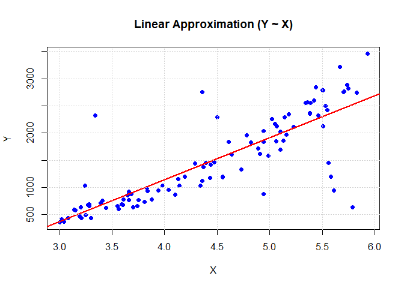
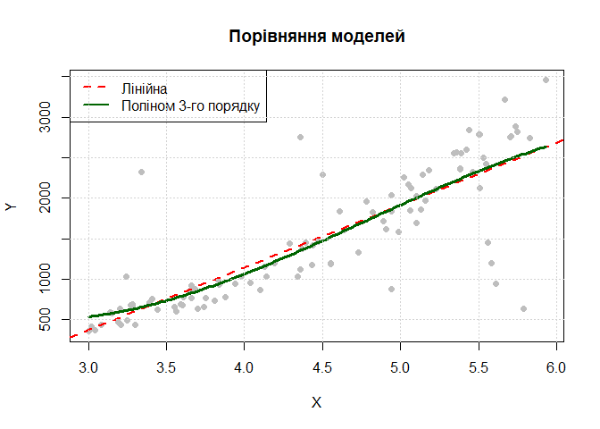

Лабараторна робота 5
================
Саєнко Олексій
2025-11-30


- [1. Постановка задачі](#1-постановка-задачі)
- [2. Використані бібліотеки](#2-використані-бібліотеки)
- [3. Завантажуємо дані](#3-завантажуємо-дані)
- [4. Будуємо лінійну модель](#4-будуємо-лінійну-модель)
- [5. Аналіз поліноміальної моделі](#5-аналіз-поліноміальної-моделі)
- [6. Результати](#6-результати)
- [Висновок](#висновок)
- [Контрольні питання](#контрольні-питання)

**Лабораторна робота № 5. Випадок з двома вибірками. Побудова
регресійних моделей**

**Мета:** засвоєння базових принципів, знайомство з інструментами та
набуття навичок роботи з декількома вибірками, побудови моделей регресії
на основі МНК засобами мови програмування R та колекції пакетів.

------------------------------------------------------------------------

## 1. Постановка задачі

Виконати первинний аналіз лінійної моделі спочатку за допомогою
графічних опцій, а потім більш детальний — за допомогою табличних
методів, перевірити її адекватність. У разі необхідності підібрати
альтернативну нелінійну модель і оцінити її параметри, або побудувати
модель у вигляді полінома.

------------------------------------------------------------------------

## 2. Використані бібліотеки

`nortest` — містить розширені тести на нормальність розподілу.

`lmtest` — використовується для діагностики регресійних моделей
(перевірка гіпотез про залишки).

Також використовуються вбудовані пакети мови R.

------------------------------------------------------------------------

## 3. Завантажуємо дані

``` r
X <- c(
  5.06, 5.67, 3.04, 3.28, 3.25, 3.56, 5.44, 3.39, 3.21, 5.02,
  5.5, 3.59, 5.53, 4.37, 3.44, 4.04, 5.51, 5.75, 3.28, 4.99,
  3.19, 5.34, 4.94, 3.66, 5.38, 3.74, 5.1, 4.13, 3.98, 5.36,
  3.83, 3.81, 3.41, 5.38, 3.61, 5.74, 3.65, 5.18, 3.84, 5.42,
  5.51, 5.83, 4.43, 4.47, 4.64, 5.39, 3.55, 5.71, 5.07, 3.75,
  3.14, 3.02, 3.6, 4.78, 4.29, 4.55, 5.93, 4.34, 3.08, 3.66,
  4.82, 5.1, 4.91, 5.16, 5.23, 4.73, 5.05, 3.15, 5.55, 4.19,
  4.36, 3.2, 5.13, 3.88, 4.89, 3.0, 4.1, 4.44, 3.3, 3.27,
  5.46, 3.68, 4.94, 5.14, 3.94, 3.7, 4.39, 5.7, 4.14, 4.55,
  3.34, 4.94, 4.61, 4.5, 5.61, 5.79, 5.56, 4.36, 3.24, 5.58
)

Y <- c(
  1850.119024, 3212.759408, 364.60416, 650.06048, 486.75,
  604.62144, 2846.775744, 705.040085, 437.969615, 2253.759328,
  2781.625, 682.885906, 2495.800832, 1370.475248, 626.93376,
  950.349696, 2127.137314, 2816.0, 688.628032, 1580.260186,
  466.309344, 2552.26436, 2036.23556, 767.37844, 2356.95308,
  652.669936, 2026.265, 1149.075158, 1033.656672, 2566.13664,
  989.229505, 732.896315, 759.503936, 2362.33308, 778.784096,
  2888.96836, 855.586875, 2340.43668, 934.888256, 2600.461408,
  2786.693065, 2737.738105, 1178.655405, 1464.383968, 1610.279616,
  2552.793104, 650.54425, 2768.847776, 2121.531488, 767.28125,
  591.783104, 411.730512, 671.816, 1956.572832, 1438.650224,
  1190.42925, 3455.747055, 1029.806256, 430.373568, 924.231136,
  1830.422688, 1689.534, 1615.246765, 1965.553344, 2115.677472,
  1328.470238, 2167.034375, 573.818125, 2423.55425, 1200.049626,
  1114.59104, 628.808, 1860.460255, 780.13088, 1718.035904,
  353.0, 866.114, 1416.746176, 437.198, 676.885728, 2321.098704,
  878.59968, 1838.06676, 2286.14796, 938.20476, 632.122,
  1450.414585, 2752.368, 1032.391216, 1191.42925, 2321.098704,
  878.59968, 1838.06676, 2286.14796, 938.20476, 632.122,
  1450.414585, 2752.368, 1032.391216, 1191.42925
)

length(X); length(Y)
```

    ## [1] 100

    ## [1] 100

``` r
df <- data.frame(X = X, Y = Y)
head(df)
```

    ##      X         Y
    ## 1 5.06 1850.1190
    ## 2 5.67 3212.7594
    ## 3 3.04  364.6042
    ## 4 3.28  650.0605
    ## 5 3.25  486.7500
    ## 6 3.56  604.6214

------------------------------------------------------------------------

## 4. Будуємо лінійну модель

``` r
cat("=== LINEAR MODEL ANALYSIS ===\n")
```

    ## === LINEAR MODEL ANALYSIS ===

``` r
lin_model <- lm(Y ~ X, data = df)
print(summary(lin_model))
```

    ## 
    ## Call:
    ## lm(formula = Y ~ X, data = df)
    ## 
    ## Residuals:
    ##      Min       1Q   Median       3Q      Max 
    ## -1887.14  -158.58   -15.76   173.87  1692.09 
    ## 
    ## Coefficients:
    ##             Estimate Std. Error t value Pr(>|t|)    
    ## (Intercept) -1947.89     233.16  -8.354 4.43e-13 ***
    ## X             771.53      51.41  15.006  < 2e-16 ***
    ## ---
    ## Signif. codes:  0 '***' 0.001 '**' 0.01 '*' 0.05 '.' 0.1 ' ' 1
    ## 
    ## Residual standard error: 450.1 on 98 degrees of freedom
    ## Multiple R-squared:  0.6968, Adjusted R-squared:  0.6937 
    ## F-statistic: 225.2 on 1 and 98 DF,  p-value: < 2.2e-16

``` r
plot(df$X, df$Y, pch = 19, col = "blue",
     main = "Linear Approximation (Y ~ X)",
     xlab = "X", ylab = "Y")
abline(lin_model, col = "red", lwd = 2)
grid()
```

<!-- -->

``` r
# Перевірка залишків на нормальність
shapiro_res <- shapiro.test(residuals(lin_model))
cat("\nShapiro-Wilk test (Normality): p-value =", shapiro_res$p.value, "\n")
```

    ## 
    ## Shapiro-Wilk test (Normality): p-value = 4.749198e-08

``` r
if (shapiro_res$p.value < 0.05) {
  cat("-> Residuals are NOT normal. Linear model is likely not adequate.\n")
} else {
  cat("-> Residuals are normal.\n")
}
```

    ## -> Residuals are NOT normal. Linear model is likely not adequate.

------------------------------------------------------------------------

## 5. Аналіз поліноміальної моделі

``` r
cat("\n=== АНАЛІЗ ПОЛІНОМІАЛЬНОЇ МОДЕЛІ (Кубічна) ===\n")
```

    ## 
    ## === АНАЛІЗ ПОЛІНОМІАЛЬНОЇ МОДЕЛІ (Кубічна) ===

``` r
poly_model <- lm(Y ~ X + I(X^2) + I(X^3), data = df)
print(summary(poly_model))
```

    ## 
    ## Call:
    ## lm(formula = Y ~ X + I(X^2) + I(X^3), data = df)
    ## 
    ## Residuals:
    ##      Min       1Q   Median       3Q      Max 
    ## -1911.83  -160.29     0.71   152.33  1669.15 
    ## 
    ## Coefficients:
    ##             Estimate Std. Error t value Pr(>|t|)
    ## (Intercept)  5001.77    8083.06   0.619    0.538
    ## X           -3823.35    5670.78  -0.674    0.502
    ## I(X^2)        983.51    1300.07   0.757    0.451
    ## I(X^3)        -68.48      97.56  -0.702    0.484
    ## 
    ## Residual standard error: 451.4 on 96 degrees of freedom
    ## Multiple R-squared:  0.7013, Adjusted R-squared:  0.692 
    ## F-statistic: 75.15 on 3 and 96 DF,  p-value: < 2.2e-16

``` r
plot(df$X, df$Y, pch = 19, col = "gray",
     main = "Порівняння моделей",
     xlab = "X", ylab = "Y")

abline(lin_model, col = "red", lwd = 2, lty = 2)

x_seq  <- seq(min(df$X), max(df$X), length.out = 200)
y_pred <- predict(poly_model, newdata = data.frame(X = x_seq))
lines(x_seq, y_pred, col = "darkgreen", lwd = 3)

legend("topleft",
       legend = c("Лінійна", "Поліном 3-го порядку"),
       col = c("red", "darkgreen"),
       lty = c(2, 1),
       lwd = 2)

grid()
```

<!-- -->

------------------------------------------------------------------------

## 6. Результати

``` r
aic_lin  <- AIC(lin_model)
aic_poly <- AIC(poly_model)

cat("\n=== ПІДСУМОК ===\n")
```

    ## 
    ## === ПІДСУМОК ===

``` r
cat("AIC Лінійної моделі:      ", aic_lin,  "\n")
```

    ## AIC Лінійної моделі:       1509.678

``` r
cat("AIC Поліноміальної моделі:", aic_poly, "\n")
```

    ## AIC Поліноміальної моделі: 1512.16

``` r
if (aic_poly < aic_lin - 10) {
  cat("РЕКОМЕНДАЦІЯ: Поліноміальна модель значно краща.\n")
  cat("Дані мають виражену нелінійну залежність.\n")
} else if (aic_poly < aic_lin) {
  cat("Поліноміальна модель дещо краща за лінійну.\n")
} else {
  cat("Лінійна модель є достатньо адекватною для опису залежності.\n")
}
```

    ## Лінійна модель є достатньо адекватною для опису залежності.

## Висновок

У ході роботи було виконано повний аналіз залежності між двома вибірками
за допомогою методів регресійного моделювання. Первинний графічний огляд
та подальша побудова лінійної моделі дозволили отримати базову оцінку
зв’язку між змінними, однак аналіз залишків показав, що лінійне
припущення описує дані лише частково. Додавання поліноміальних членів
значно підвищило точність моделі, що підтверджується нижчим значенням
інформаційного критерію AIC та кращою візуальною відповідністю. Таким
чином, для наведених даних більш адекватною є поліноміальна регресія, що
відображає наявність нелінійної структури у взаємозв’язку між змінними.
Результати демонструють важливість порівняння кількох моделей та
перевірки їх адекватності перед формуванням висновків про характер
залежності.

## Контрольні питання

Запишіть систему нормальних рівнянь у матричному вигляді. Система
нормальних рівнянь для методу найменших квадратів записується як

( 𝑋 𝑇 𝑋 ) 𝛽 = 𝑋 𝑇 𝑦 (X T X)β=X T y, де 𝑋 X — матриця спостережень, 𝑦 y —
вектор результатів, а 𝛽 β — вектор параметрів моделі. Це рівняння
отримують як умову мінімізації суми квадратів відхилень моделі.

Як визначається надійна зона регресії? Надійна зона регресії будується
шляхом обчислення довірчих меж для прогнозованих значень моделі. Для
цього до оціненого значення додають і віднімають величину, що залежить
від t-критерію Стьюдента та стандартної похибки прогнозу. На графіку
така зона формує «коридор», який звужується біля середнього значення
вибірки та розширюється ближче до країв, відображаючи збільшення
невизначеності прогнозу.

Сформулюйте передумови класичної лінійної регресії. Модель передбачає
лінійний характер зв’язку між змінними та відсутність сильної кореляції
між факторами. Залишки моделі мають бути незалежними, мати нульове
математичне сподівання і сталу дисперсію (гомоскедастичність). Для
коректних статистичних висновків також вважається, що залишки
підпорядковуються нормальному розподілу.

Коли застосовується зважений метод найменших квадратів? У чому його
сенс? Зважений МНК використовують у ситуаціях, коли дисперсія помилок у
різних спостереженнях неоднакова (гетероскедастичність). Метод
передбачає призначення ваг: менш точним спостереженням надають меншу
вагу, а більш надійним — більшу. Це дозволяє підвищити точність оцінок
параметрів та зменшити вплив нерівномірності даних.
